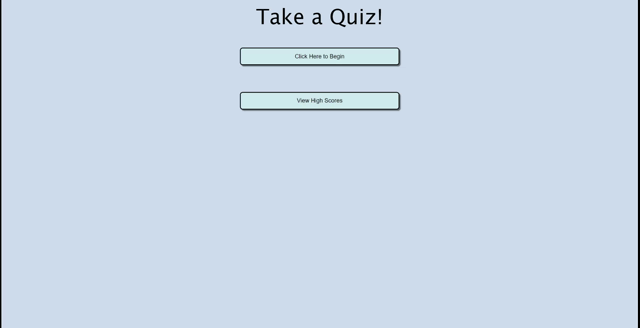
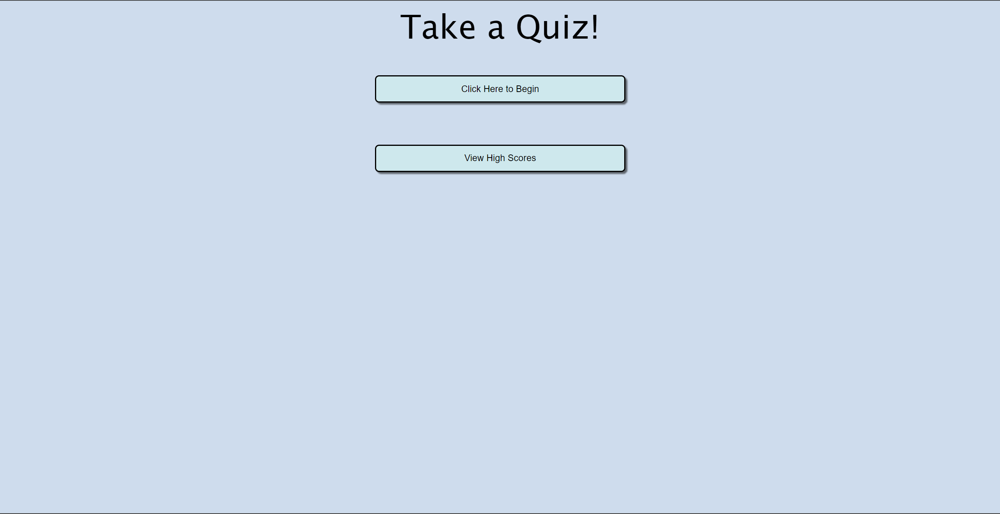

# Timed-Quiz

## Description

I wanted to create a timed quiz that I could populate with my own questions to practice! I also wanted to be able to save the scores to local storage and retrieve them. This page is the result! This project was a great springboard for going deeper into javaScript for me, and I learned more about using local storage and navigating arrays.

## Visuals

## Link

https://strongjaw15.github.io/timed-quiz/

## Credits

Thanks to Eric Meyer at http://meyerweb.com/eric/tools/css/reset/ for the CSS Reset.